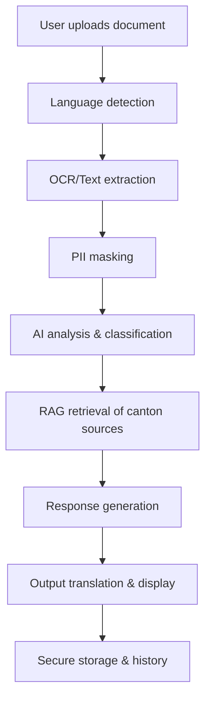
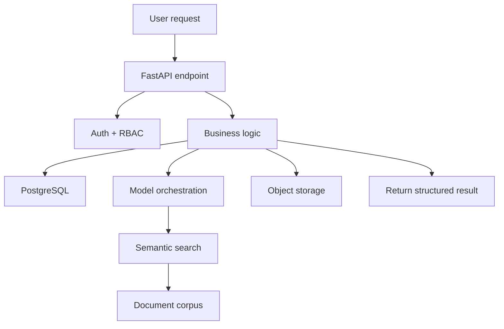

# SwissMigrate AI

> SwissMigrate AI is an AI-powered Swiss migration assistance platform for migrants, asylum seekers, refugees, students, and workers.
> It helps users understand official letters, analyze migration documents, access canton-specific guidance, organize case files, and receive AI-assisted recommendations.

---

## Table of Contents

1. [What is SwissMigrate AI](#what-is-swissmigrate-ai)
2. [Why it exists](#why-it-exists)
3. [User problems](#user-problems)
4. [Who this serves](#who-this-serves)
5. [Product status](#product-status)
6. [Core product foundations](#core-product-foundations)
7. [Current implementation](#current-implementation)
8. [Planned scope](#planned-scope)
9. [Production vision](#production-vision)
10. [Architecture](#architecture)
11. [AI system](#ai-system)
12. [OCR and document pipeline](#ocr-and-document-pipeline)
13. [RAG and semantic search](#rag-and-semantic-search)
14. [Security and privacy](#security-and-privacy)
15. [Contributor guide](#contributor-guide)
16. [Developer setup](#developer-setup)
17. [Roadmap and priorities](#roadmap-and-priorities)
18. [Technical decisions](#technical-decisions)
19. [Glossary](#glossary)

---

## What is SwissMigrate AI

SwissMigrate AI is a migration support platform for people navigating Swiss administrative processes.

It combines:
- document intake and OCR
- automated migration letter analysis
- canton-specific guidance
- secure case management
- multilingual interaction
- AI-assisted recommendations and future prediction support

This is a product-led platform with a clear transition path from a Streamlit prototype to a production-grade service.

---

## Why it exists

Swiss migration processes are complex, time-sensitive, and language-sensitive.
Migrants need reliable help with:
- interpreting official letters from SEM and Swiss authorities
- understanding canton-specific rules
- knowing deadlines and required actions
- storing migration documents securely
- receiving trustworthy recommendations

SwissMigrate AI exists to reduce that friction by delivering a practical, secure, and explainable support system.

---

## User problems

| Problem | Why it matters | SwissMigrate AI response |
|---|---|---|
| Official letters are hard to read | Users face unknown legal terms and deadlines | Document analysis and AI-assisted summaries |
| Documents are scattered | Lost evidence causes delays and risk | Secure file vault with metadata and versioning |
| Migration rules differ by canton | One-size-fits-all advice is wrong | Canton-specific guidance and data retrieval |
| People use mobile phones more than desktops | Desktop-only experiences fail | Mobile-first UI and PWA roadmap |
| Sensitive data must be protected | Migration files are highly personal | Encryption, RBAC, GDPR planning |
| AI answers can hallucinate | Trust is critical in legal contexts | Semantic retrieval, citation, and source grounding |

---

## Who this serves

Primary users:
- migrants and asylum seekers
- refugees and displaced people
- international students
- foreign workers
- NGO caseworkers and legal assistants
- public-sector advisory teams

Secondary users:
- product managers defining roadmap
- engineers building secure ML systems
- partners evaluating the platform for deployment

---

## Product status

### Current implementation

The prototype currently provides:
- Streamlit-based frontend and application flow
- letter upload and OCR for PDFs, Word, and images
- multilingual interface selection
- canton and migration profile selection
- AI-assisted document summaries and recommendation hints
- history tracking for user interactions
- local CSV-backed storage and file handling

### Planned scope

The next phase is to build:
- FastAPI backend and modern React/Vue frontend
- PostgreSQL storage and secure object storage
- ML-based document classification and field extraction
- semantic RAG with embeddings for canton answers
- secure document vault with encryption
- deadline detection and reminder system
- NGO dashboards, KPI reporting, and role-based access

### Future vision

Longer-term production goals:
- predictive SEM and federal court outcome estimation
- adaptive personalization and recommendation learning
- document authenticity and fraud detection
- multi-language legal terminology support
- production ML monitoring and data pipelines
- PWA with offline support and mobile-first UX

---

## Core product foundations

This project is built around these prioritized user stories. Each story informs architecture, AI design, and roadmap choices.

### Foundation stories

1. **API-first FastAPI backend** – build a decoupled, scalable backend for all services.
2. **Secure authentication and RBAC** – protect migration data and support NGO roles.
3. **Predictive SEM and court outcome estimation** – provide evidence-based decision support.
4. **Automatic letter classification and field extraction** – automate document triage.
5. **Deep learning OCR** – support scanned forms, handwriting, and complex layouts.
6. **Secure migration document vault** – store documents with encryption and access control.
7. **Mobile-first PWA interface** – serve users on phones and low-bandwidth networks.
8. **Smart reminders and deadline detection** – reduce missed legal deadlines.
9. **Semantic retrieval with embeddings** – ground answers in trusted canton documents.
10. **Production-grade data pipeline** – support ingestion, embeddings, analytics, and ML monitoring.
11. **NGO dashboards with KPIs** – support institutional workflows and reporting.
12. **Multilingual and localized guidance** – make guidance accurate in multiple languages.
13. **GDPR-ready audit logs and deletion workflows** – meet privacy regulations.
14. **AI legal assistant** – generate official letters and appeals with confidence.
15. **ML-based personalization** – adapt recommendations to user behavior.
16. **Document authenticity validation** – reduce fraud and risk.

---

## Architecture

SwissMigrate AI is designed to move from prototype to production along a clear architecture path.

### Architectural layers

- **UI layer**: modern web client, mobile-first, PWA-ready.
- **API layer**: FastAPI backend with clean service boundaries.
- **Data layer**: PostgreSQL for structured data, secure object storage for files.
- **AI layer**: model orchestration, embeddings, RAG, and ML services.
- **Security layer**: auth, RBAC, encryption, audit, compliance.

### Architecture goals

- decouple frontend and backend
- make AI workflow explicit
- ensure secure document handling
- support fast integration with partners
- enable production observability

### Why FastAPI

FastAPI is chosen for its:
- async performance for I/O-heavy workflows
- automatic OpenAPI documentation
- fast developer iteration
- strong Python ecosystem compatibility with ML and data tools

### Why PostgreSQL + object storage

PostgreSQL solves:
- transactional reliability
- structured case metadata
- queryable user and audit data

Object storage solves:
- secure file persistence
- versioning and auditability
- scalable document handling without database bloat

### Why React/Vue + PWA

Modern web frameworks provide:
- responsive UI and mobile-first layout
- component-based maintainability
- PWA features for offline and app-like experiences

---

## System flows

### Document intake flow



### User request flow



---

## AI system

SwissMigrate AI uses practical, explainable AI.

### AI components

| Component | Purpose | Status |
|---|---|---|
| OCR engine | Extract text from scanned letters and documents | Current prototype
| PII masking | Remove sensitive data before AI analysis | Current prototype
| Document classification | Detect letter type and urgency | Planned
| Field extraction | Extract dates, authority, case number, deadline | Planned
| Semantic retrieval | Find trusted canton content | Planned
| Predictive estimation | Estimate SEM/court outcomes | Future
| Personalization | Recommend next actions by user behavior | Future
| Legal assistant | Draft letters and appeals | Planned

### AI design principles

- **Grounded answers**: cite sources when using RAG.
- **Explainable output**: show why a recommendation was made.
- **Language-aware processing**: analyze text in the source language where possible.
- **Privacy-first AI**: mask PII before model inference.
- **Confidence-aware responses**: surface uncertainty when needed.

### Model strategy

- detect language before analysis
- choose specialized or multilingual models per input
- use embeddings for semantic search instead of keyword matching
- use supervised ML only with validated data
- keep predictive models explainable and constrained

---

## OCR and document pipeline

### Current capability

- accepts uploads as text, PDF, Word, or image
- runs OCR on non-text documents
- applies basic PII redaction
- stores extracted text and metadata

### Production pipeline

1. user uploads document
2. detect input language
3. OCR / text extraction
4. PII masking and redaction
5. document classification
6. field extraction (dates, deadlines, case IDs)
7. semantic embedding generation
8. secure storage of original and extracted data

### Why this pipeline

- separates text extraction from AI reasoning
- makes privacy decisions auditable
- improves search accuracy
- prepares the system for ML training

---

## RAG and semantic search

### Why RAG

Reactive AI answers are risky for legal and migration use cases.
RAG ensures:
- answers are grounded in canton documents
- hallucinations are reduced
- source provenance is visible

### RAG flow

1. create embeddings for user query and documents
2. search vector store for relevant content
3. retrieve top sources and score relevance
4. pass sources to AI with user prompt
5. generate answer with citations and confidence data

### Expected benefits

- better canton-specific accuracy
- defensible answers
- multilingual support for canton rules

---

## Security and privacy

### Key principles

- treat migration cases as sensitive personal data
- minimize exposure of PII
- enforce role-based access
- log all access and actions
- comply with GDPR and Swiss privacy requirements

### Controls

- **Authentication**: JWT sessions or OAuth for partners
- **Authorization**: RBAC for users, caseworkers, and NGOs
- **Encryption**: TLS in transit, encryption at rest for sensitive fields
- **Audit logging**: track document access, AI queries, and data changes
- **Data retention**: define retention and deletion workflows

### Document vault

The document vault should provide:
- encrypted storage for uploaded files
- version history for documents
- metadata tagging for deadlines and authorities
- secure retrieval with access control

---

## Contributor guide

### First contributions

- fix gaps in the current Streamlit prototype
- implement API-first backend endpoints
- replace CSV storage with PostgreSQL
- add basic auth and RBAC
- build document intake and metadata flows
- add semantic search and embedding generation

### Code structure

Expected modules:
- `app.py` / frontend entry point
- `services/` for AI, OCR, storage, RAG, security logic
- `modules/` for feature UI and business workflows
- `utils/` for shared helpers, constants, translations
- `data/` for canton content and reference material
- `storage/` for persistence adapters

### Contribution workflow

1. fork the repo
2. create a feature branch
3. run local tests and formatting
4. open a PR with clear scope
5. document architecture changes in this wiki

### Review expectations

- changes should be incremental
- backend logic must be testable
- AI behavior must be grounded and explainable
- security changes should include threat reasoning
- update roadmap when adding new feature areas

---

## Developer setup

### Local requirements

- Python 3.11+
- `pip` or virtual environment
- optional: Tesseract OCR for local testing

### Install and run (prototype)

```bash
python -m venv .venv
.\.venv\Scripts\activate
pip install -r requirements.txt
python app.py
```

### Recommended workflow

- run `app.py` for the prototype
- inspect `services/` for backend logic
- inspect `modules/` for feature flows
- use `config.py` for environment settings

### Production migration steps

1. build FastAPI backend with OpenAPI docs
2. replace CSV storage with PostgreSQL
3. add secure file storage integration
4. move frontend to React/Vue
5. add auth, RBAC, and logging
6. implement semantic RAG and ML pipelines

---

## Roadmap and priorities

### MVP target

- API-first backend foundation
- document intake, OCR, and PII masking
- letter helper and canton guidance
- secure storage planning
- basic multilingual interface

### Next milestone

- deep learning OCR and document classification
- semantic retrieval and source grounding
- deadline reminder workflow
- secure vault and RBAC
- NGO dashboard prototype

### Production milestone

- predictive SEM / court outcome support
- ML personalization and recommender engine
- document authenticity validation
- GDPR audit and deletion workflows
- PWA mobile experience

### Roadmap principles

- deliver in vertical slices: backend + feature + storage
- keep AI grounded with sources and confidence scores
- make every feature auditable and testable
- avoid building advanced features before infrastructure exists

---

## Technical decisions

### Why not keep Streamlit

Streamlit is useful for prototypes, but not enough for production.
Production requires:
- decoupled frontend/backend
- browser-first UX
- authentication flows
- mobile-responsive UI

### Why API-first

API-first architecture lets us:
- separate UI from business logic
- support multiple clients (web, mobile, partner portals)
- scale services independently
- create clear contracts for developers

### Why semantic search

Keyword search is not enough for legal and canton content.
Semantic search provides:
- meaning-based retrieval
- better cross-language results
- stronger grounding for AI responses

### Why production data pipelines

A production AI platform needs data observability.
Pipelines ensure:
- ingestion is reliable
- embeddings are fresh
- models use clean data
- analytics and monitoring are available

---

## Glossary

- **SEM** — State Secretariat for Migration
- **RAG** — Retrieval-Augmented Generation
- **PWA** — Progressive Web App
- **RBAC** — Role-Based Access Control
- **GDPR** — General Data Protection Regulation
- **OCR** — Optical Character Recognition
- **Embedding** — vector representation of text for semantic search

---

## Notes

This document is intended to represent the project as a real startup-grade product.
It separates what exists now from what is planned and what is future.
It is a practical guide for engineers, product owners, and stakeholders.
